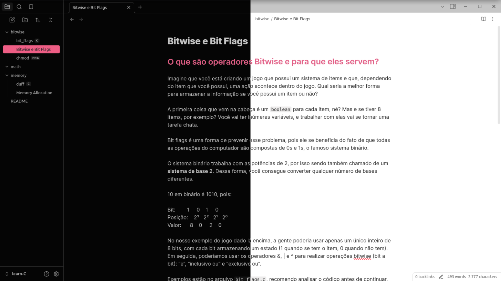

# Sunbather



A minimal pink theme for Obsidian based on [vim-sunbather theme](https://github.com/nikolvs/vim-sunbather).

[vim-sunbather theme]: https://github.com/nikolvs/vim-sunbather

## Installation

You can install this theme in two ways:

### Method 1: Via Community Themes (Recommended)

1. Open Obsidian.

2. Go to Settings → Appearance → Themes.

3. Search for "Sunbather" in the Community Themes section.

4. Click Install and then Use to apply the theme.

### Method 2: Manual Installation

1. Clone this repo in your `.obsidian/themes` folder

```
git clone https://github.com/chachacollins/chacha-obsidian.git
```
If the `.obsidian/themes` folder doesn't exist, create it first.

2. Open Obsidian and go to Settings → Appearance  →  Themes.

3. Select "Sunbather" from the list of available themes.

## License

This project is licensed under the MIT License. See the LICENSE file for details.

## Credit
credit to [babidisrc](https://github.com/babidisrc) for the first version of this theme.
